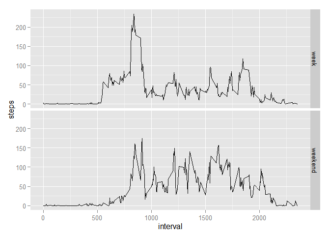

# Reproducible Research: Peer Assessment 1


## Loading and preprocessing the data

Unzip, load and change the date format of the data.

The variables included in this dataset are:

1. steps: Number of steps taking in a 5-minute interval (missing values are coded as NA)
2. date: The date on which the measurement was taken in YYYY-MM-DD format
3. interval: Identifier for the 5-minute interval in which measurement was taken

Show characteristics of the data.

```r
library(knitr)
```

```
## Warning: package 'knitr' was built under R version 3.1.3
```

```r
opts_chunk$set(fig.path="figure/", fig.keep='all')
setwd("D:/rezuil/Documents/R/Reproducible Research/Assignment 1, week 2")
unzip("repdata-data-activity.zip")
data <- read.csv("activity.csv", header=TRUE, sep=",", na.strings="NA")
data$date <- as.Date(data$date)

head(data)
```

```
##   steps       date interval
## 1    NA 2012-10-01        0
## 2    NA 2012-10-01        5
## 3    NA 2012-10-01       10
## 4    NA 2012-10-01       15
## 5    NA 2012-10-01       20
## 6    NA 2012-10-01       25
```

```r
str(data)
```

```
## 'data.frame':	17568 obs. of  3 variables:
##  $ steps   : int  NA NA NA NA NA NA NA NA NA NA ...
##  $ date    : Date, format: "2012-10-01" "2012-10-01" ...
##  $ interval: int  0 5 10 15 20 25 30 35 40 45 ...
```

```r
summary(data)
```

```
##      steps             date               interval     
##  Min.   :  0.00   Min.   :2012-10-01   Min.   :   0.0  
##  1st Qu.:  0.00   1st Qu.:2012-10-16   1st Qu.: 588.8  
##  Median :  0.00   Median :2012-10-31   Median :1177.5  
##  Mean   : 37.38   Mean   :2012-10-31   Mean   :1177.5  
##  3rd Qu.: 12.00   3rd Qu.:2012-11-15   3rd Qu.:1766.2  
##  Max.   :806.00   Max.   :2012-11-30   Max.   :2355.0  
##  NA's   :2304
```
## What is mean total number of steps taken per day?

```r
suppressWarnings(library(ggplot2))
# install.packages("ggplot2")
daily <- aggregate(steps ~ date, data = data, FUN = sum)
qplot(steps, data = daily, geom="histogram", xlab = "Daily number of steps", binwidth = 200)
```

 

```r
daily_mean <- mean(daily$steps)
daily_median <- median(daily$steps)
```

The mean of the total number of steps taken per day is 10766  
The median of the total number of steps taken per day 10765

## What is the average daily activity pattern?

The total number of steps is now averaged for each 5-minute interval across all days with valid data. And the interval with the max average of steps is calculated (08:35)


```r
intervals <- aggregate(steps ~ interval, data = data, FUN=mean)
qplot(interval, steps, data = intervals)
```

 

```r
intervals[which.max(intervals$steps),]
```

```
##     interval    steps
## 104      835 206.1698
```

## Imputing missing values
Calculate and report the total number of missing values in the dataset (i.e. the
total number of rows with NAs)

```r
# In the first part we already saw that there are 2304 missing values in steps, none in other fields
nrow(data[which(is.na(data$steps)),])
```

```
## [1] 2304
```

```r
# install.packages("dplyr")
suppressWarnings(library(dplyr))
```

```
## 
## Attaching package: 'dplyr'
## 
## The following objects are masked from 'package:stats':
## 
##     filter, lag
## 
## The following objects are masked from 'package:base':
## 
##     intersect, setdiff, setequal, union
```

```r
# now add for the NA's the value of the mean over de the interval / days. The mean is stored in intervals calculated before
# first merge, dan change the NA value, then remove the merged column
data2 <- merge(data, intervals, by="interval")
data2 <- data2 %>%
         mutate(steps.x = ifelse( is.na(steps.x), steps.y, steps.x))
data2 <- data2[,c("interval", "steps.x", "date")]

daily <- aggregate(steps.x ~ date, data = data2, FUN = sum)
qplot(steps.x, data = daily, geom="histogram", xlab = "Daily number of steps", binwidth = 200)
```

 

```r
daily_mean <- mean(daily$steps.x)
daily_median <- median(daily$steps.x)
```

The mean of the total number of steps taken per day is 10766  
The median of the total number of steps taken per day 10766
Replacing the NA's with the mean doesn't have influence on the mean, but does have some minor influence on the median.

## Are there differences in activity patterns between weekdays and weekends?
Split the data in weekend and week data and make the activity plot again

```r
data$day <- ifelse(as.numeric(format(data$date, "%u")) >5, "weekend", "week")
intervals <- aggregate(data$steps, by = list(data$day, data$interval), mean, na.rm = TRUE)
names(intervals) = c("day", "interval", "steps")
ggplot(intervals, aes(x = interval, y = steps)) + geom_line() + facet_grid(day~.)
```

 
From these plots we can see that the person starts stepping later in teh weekend, and stops sooner during the week. The max number of steps is higer during the week.

